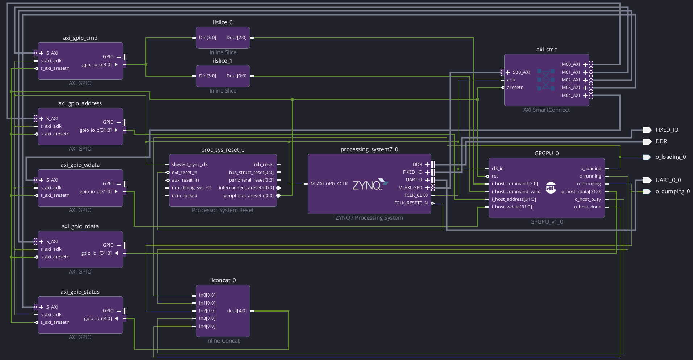

## Create the GPGPU Block Design

For the CLI flow, use:

```bash
./gpgpu run vivado:block-design:build
./gpgpu run vivado:block-design:run
```

`:build` reuses and exports the saved BD from the managed build project, or
creates the default from `tools/hardware/vivado/create_block_design.tcl`.
`:run` depends on `:build` and generates the output products / HDL wrapper.
The saved BD takes priority over template edits; close Vivado before running
these commands and review any template changes before committing. See
[Vivado CLI flow](vivado-cli.md) for preservation, configuration, and dependencies.

The equivalent GUI setup is described below.

1) IP Integrator > Create Block Design > `gpgpu_block_design`.

2) Add the following blocks:
- 1 x ZYNQ 7000 PS
- 5 x AXI GPIO blocks:
	- name `axi_gpio_cmd`, select All Outputs, GPIO Width: 4
	- name `axi_gpio_address`, select All Outputs, GPIO Width: 32
	- name `axi_gpio_wdata`, select All Outputs, GPIO Width: 32
	- name `axi_gpio_rdata`, select All Inputs, GPIO Width: 32
	- name `axi_gpio_status`, select All Inputs, GPIO Width: 5
- 2 x Inline Slice blocks, 
- 1 x Inline Concat
- 1 x the GPGPU RTL design (drag and drop).

3) Connect `GPGPU_0`'s wires `o_idle`, `o_running`, `o_host_busy`, `o_host_done` to the Inline Concat Block inputs 0–3, respectively (4 inputs, 1 output), and connect its output to `axi_gpio_status/gpio_io_i` (4 bits).

4) Connect `axi_gpio_cmd/gpio_io_o` output to the first Inline Slice block: Din Width 4, Din From 2, Din Down To 0, Dout Width 3, and connect the `axi_gpio_cmd/gpio_io_o` output to the second Inline Slice block: Din Width 4, Din From 3, Din Down To 3, Dout Width 1.

5) Set PS output clock frequency: double tap on PS > Clock configuration > PL Fabric Clocks > `FCLK_CLK0`, change the Requested Frequency.

6) Select DDR configuration in PS (Memory part MT41K256M16 RE-125 for hellofpga's board).

7) Select PS > MIO Configuration > I/O Peripherals > Peripheral: UART 0 and IO: EMIO.

8) Run Design Automation Assistant.

The CLI then applies the AXI GPIO address map from
`hardware.vivado.host_interface` in `config/profiles/default.yaml`. The default
mapping is `address=0x41200000`, `cmd=0x41210000`, `rdata=0x41220000`,
`status=0x41230000`, and `wdata=0x41240000`, each with a `0x00010000` range.

9) Connect `processing_system7_0/FCLK_CLK0` to `GPGPU_0/clk_in` and `proc_sys_reset_0/peripheral_aresetn` to `GPGPU_0/rst`, if not connected by the assistant.

10) Make the port `processing_system7_0/UART_0` external, then go to RTL Analysis > Open Elaborate Design.

11) Click Sources > Design Sources > `gpgpu_block_design` > Create HDL Wrapper (all options default), which creates `gpgpu_block_design_wrapper`.

12) Set `gpgpu_block_design_wrapper` as Top Level Module.



13) Generate bitstream

## Vitis Setup

1) In vivado, go to File > Export > Export Hardware, select include bitstream, but not binary, name it, for example, `gpgpu_platform.xsa`.

2) Open Vitis Tools > Launch Vitis IDE

3) Create Platform: File > New Component > Platform, select the `gpgpu_platform.xsa` file vivado generated.

4) Create ARM application: New Component > Application, name it, for example, `gpgpu_host`, select Platform > `gpgpu_platform`, in the Source Files page select add the sources and select the repo's `software/host/xc7z020/` directory.

5) Select VITIS COMPONENTS > `gpgpu_platform`, FLOW > select `gpgpu_platform` > Build.

6) Select VITIS COMPONENTS > `gpgpu_host`, FLOW > select `gpgpu_host` > Build.

Or, using the cli:

The CLI recreates the repository's portable Vitis 2026.1 default project from the
Vivado XSA and enforces platform-before-host build ordering:

```bash
./gpgpu run vitis:project
./gpgpu run vitis:build:all
```

The editable workspace is `build/software/vitis`. Interactive CLI builds show a
[JSON-backed build monitor](run-monitor.md) with stage progress, durations, and
live logs; use `./gpgpu run vitis:build:all --plain` for streaming plain output.
Open the workspace directory in Vitis
to change the `gpgpu_platform` or `gpgpu_host` components. After saving and
closing Vitis, explicitly synchronize those changes back to the committed
portable default:

```bash
./gpgpu run vitis:export
```

The expected programming artifacts are:

```text
build/hardware/bitstream/gpgpu_block_design_wrapper.bit
build/software/vitis/gpgpu_platform/export/gpgpu_platform/hw/sdt/ps7_init.tcl
build/software/vitis/gpgpu_host/build/gpgpu_host.elf
```

The `.bit` is the Vivado-published artifact, not a standalone file under the
Vitis platform export's `hw/sdt` directory.

## Upload to the board-connected machine

After building, transfer the three artifacts with:

```bash
./gpgpu run fpga:upload
```

The upload preserves the remote filenames `gpgpu_platform.bit`, `ps7_init.tcl`,
and `gpgpu_host.elf` used by the manual programming workflow. It does not rebuild
or program the board. See [FPGA CLI flow](fpga-cli.md) for SSH configuration,
prerequisites, and the local-to-remote artifact mapping.

## Program through the FPGA Agent

After uploading the artifacts, program the board with:

```bash
./gpgpu run fpga:program
```

To upload the existing local artifacts and then run the same programming flow
with one command instead:

```bash
./gpgpu run fpga:deploy
```

Deploy orders upload before the entire preflight/reset/mode/program sequence.
Missing local files fail before any transfer; a transfer failure prevents all
board operations. It never invokes a vendor build, and resends the artifacts
on every invocation. `fpga:program` remains program-only for already uploaded
files. Upload and programming stages have separate logs and monitor status.

This first validates all programming settings and checks the uploaded bitstream,
`ps7_init.tcl`, and host ELF with read-only `test -f` in the VM upload directory.
If any is missing or is not a file, it fails before reset, mode, or programming.
The logged order is `fpga:preflight` → `fpga:program:reset` →
`fpga:mode:project` → `fpga:program`. After preflight it resets while preserving
the current mode, switches to PROJECT, programs PL, then initializes and starts
PS with the host ELF. It never builds or uploads automatically. Standalone
`fpga:reset`, `fpga:mode:project`, and `fpga:mode:demo` remain independent of
uploaded files; mode commands do not reset. Configure the FPGA device and any
Agent-visible directory override as described in [FPGA CLI flow](fpga-cli.md).
SSH opens the board-connected shell; interactive Bash loads its shortcuts from
`~/.bashrc`. Preflight uses no board helper. Each mutating session selects the
device with `fuse`; the flow uses `fr`, `fm project`, `fpl <bitstream>`, and
`fps <ps7_init.tcl> <host.elf>`. Socket/container access is handled by the
installed helpers, not by this CLI. VM file checks do not prove Agent/container
mount visibility; checked helper responses remain necessary for mapping/API
errors.

See [Vitis CLI flow](vitis-cli.md) for configuration, individual build stages,
and export portability guarantees.
